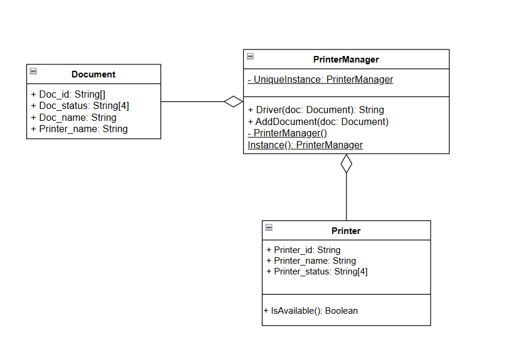

# Лабораторная работа №1

## Предметная область
   Паттерн «Одиночка» широко применяется в операционных системах для управления критическими ресурсами. Один из примеров – работа менеджера печати.  
**Менеджер печати** – это системная служба операционной системы, которая управляет процессом взаимодействия компьютера с принтером, упорядочивает документы в очереди и отправляет их на печать.
## Описание проблемы
   В операционной системе может быть несколько приложений, которые отправляют документы на печать. Если каждое приложение будет напрямую взаимодействовать с принтером, то есть создавать свой собственный экземпляр менеджера печати, это приведёт к:
   - образованию множества очередей - документы будут "размазаны" по очередям
   - конфликтам при одновременной печати
   - дублированию данных - список принтеров будет дублироваться в каждом экземпляре, из-за чего будет несогласованность состояния, лишнее потребление памяти
   - потере документов - при закрытии приложения его очередь теряется

## Решение проблемы
   Использование паттерна "Одиночка". Он организует в менеджере печати одну очередь печати, через которую будут проходить все документы. 
## Диаграмма классов

## Выводы
Внедрение паттерна Одиночка в менеджер печати позволило:
- Централизовать управление - все операции проходят через единую очередь
- Исключить конфликты - принтер получает команды из одного источника
- Обеспечить согласованность - все компоненты видят актуальное состояние
- Предотвратить потерю данных - документы хранятся в единой очереди
- Упростить архитектуру - глобальный доступ без передачи ссылок
